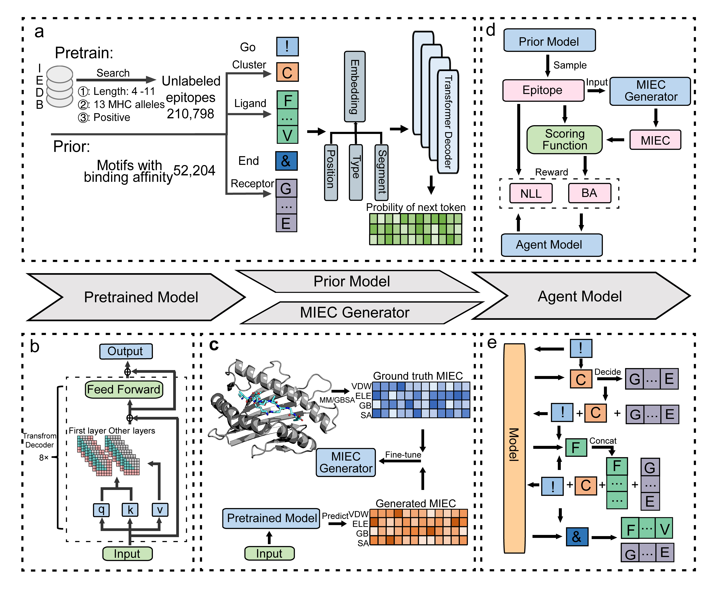

# RLpMIEC
## Vaccine Generation Targeting Major Histocompatibility Complex-I Guided and Interpreted by Interaction Spectrum-Navigated Reinforcement Learning

## Setup Environment
Start with a new environment. Run:

    conda env create -f environment.yaml
    
Or it is accept to just install the basic packetage the model relied.
## For pretrained model
    python mhc_train.py  --data_name mhc_iedb --batch_size 128 --max_epochs 200 --save_name pretrain_model --n_layer 8  --learning_rate 1e-2 --is_pretrain T

## For prior model
    python mhc_train.py  --data_name  mhc_data_all --batch_size 128 --max_epochs 200 --pre_save_name pretrain_model --save_name piror_model --n_layer 8  --learning_rate 4e-4 --is_continue T

## For MIEC generator
    python mhc_train.py  --data_name  mhc_data_all --batch_size 128 --max_epochs 200 --pre_save_name pretrain_model --save_name miec_generator --n_layer 8  --learning_rate 4e-4 --is_continue T  --is_mc T

## For agent model
    python RL_train.py --prior_name prior_model  --score_name score_model --batch_size 64 --vocab_size 36 --block_size 11 --tmp 1 --max_epochs 2000 --save_name agent_model --learning_rate 4e-4 --sigma 60

## For evaluation and sequence generation
### If calculate the novelty, add--novel_check T --novel_check_path {your own traindataset}
    python eval.py --save_name agent_model --prior_name prior_model --miec_name miec_generator --gensize 5024 --batch_size 32
